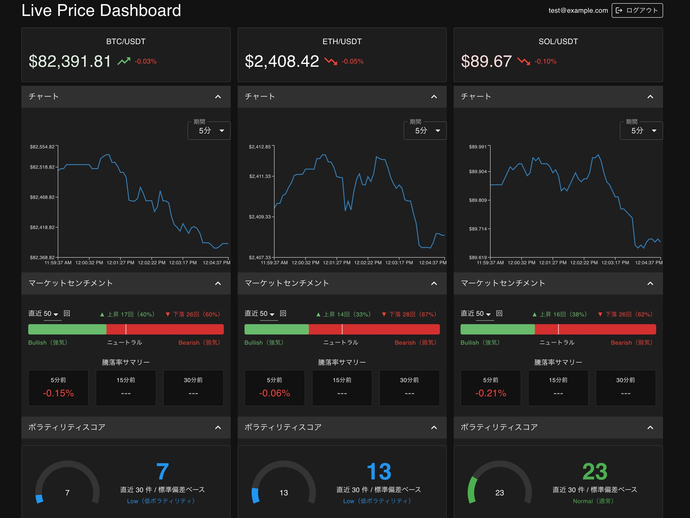
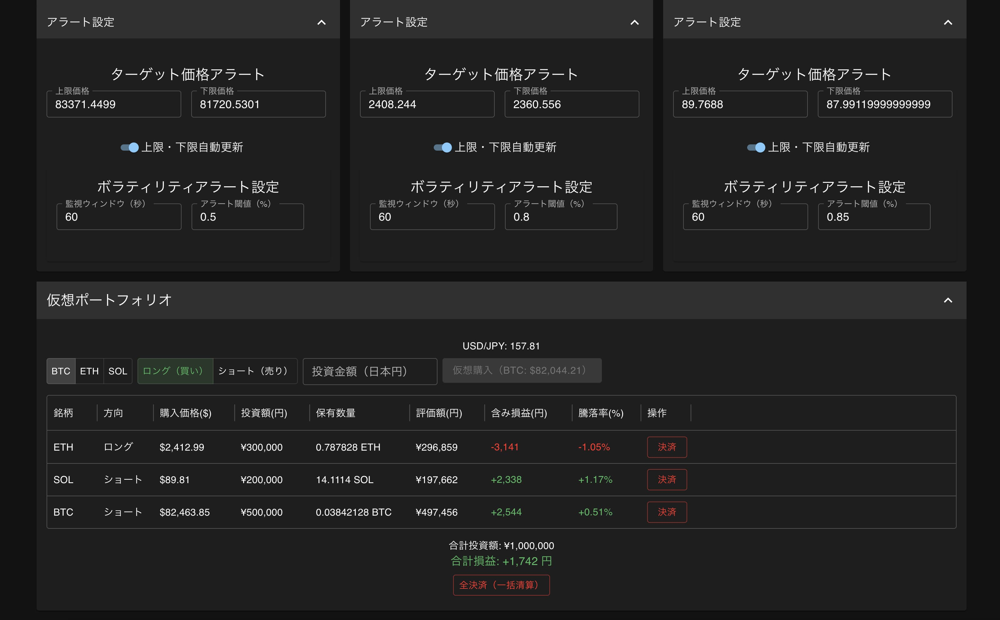

# 1. このアプリについて

## リアルタイム価格変動ダッシュボード (React + Node.js + WebSocket)

暗号資産（BTC・ETH・SOL）の価格をBinance APIからリアルタイムで取得し、チャートやアラートで可視化するダッシュボードWebアプリです。<br>
ユーザ認証・仮想ポートフォリオ・価格アラートなど、投資判断を補助する機能を備えています。<br>

### ■ 価格表示・価格チャート・マーケットセンチメント・ボラティリティスコア



### ■ ターゲット価格アラート・ボラティリティアラート・仮想ポートフォリオシミュレータ



---

<br>

# 2. デモ

https://livepricedashboard.kanda-software-labo.com/
<br>
(テスト用アカウント: test@example.com / stockholm1912)

テスト用アカウントを使用してすべての機能を試すことができます。

---

<br>

# 3. 主な機能

- **リアルタイム価格表示**：Binance WebSocket APIからBTC・ETH・SOLの約定価格を取得し、5秒ごとにダッシュボードへ配信
- **価格チャート**：直近5分・15分・30分の価格推移を折れ線グラフで表示（表示期間を切り替え可能）
- **マーケットセンチメント**：直近N件の価格変動から「買い圧・売り圧」の比率をリアルタイムで可視化
- **ボラティリティスコア**：標準偏差ベースのスコア（0〜100）を半円ゲージで表示。高ボラティリティ時はアラートを発火
- **ターゲット価格アラート**：上限・下限価格を設定し、到達時にブラウザ通知（Snackbar）を表示。自動再設定（±1%オフセット）にも対応
- **ボラティリティアラート**：指定した監視ウィンドウ（秒）内の変化率が閾値を超えたらアラート通知
- **仮想ポートフォリオシミュレーター**：BTC・ETH・SOLの仮想購入（ロング・ショート）を登録し、現在価格に基づく含み損益をリアルタイムで計算・表示
- **ユーザ認証**：メールアドレス・パスワードによるアカウント登録・ログイン・ログアウト
- **複数端末ログイン制限**：同一ユーザが別端末からログインすると、旧セッションを自動切断して通知
- **設定の永続化**：アラート設定・ポートフォリオデータをPostgreSQLに保存し、再ログイン後も復元

---

<br>

# 4. 使用方法

## ■ アカウント登録 / ログイン

- 初回利用時はログイン画面のリンクからアカウントを登録してください。
- 登録済みの場合はメールアドレスとパスワードでログインしてください。
- **2.デモ**に記載のテスト用アカウントですぐにログイン可能です。

## ■ ダッシュボード

- ログイン後、BTC・ETH・SOLの価格カードが3カラムで表示されます（幅1350px以下では BTC のみ表示）。
- 各銘柄パネル内のアコーディオンを開くと、チャート・マーケットセンチメント・ボラティリティスコア・各種アラート設定が表示されます。

## ■ リアルタイム価格表示

- 最新のBTC・ETH・SOLの価格、前回価格との比較アイコン、ボラティリティアラート判定で算出した騰落率を表示します。
- 価格上昇時は価格を緑色でフラッシュし、価格下降時は価格を赤色でフラッシュするアニメーションが動作します。
- ボラティリティアラートのアラート発生時は、価格カード全体を赤くフラッシュするアニメーションが動作します。

## ■ 価格チャート

- BTC・ETH・SOLの価格推移を折れ線グラフで表示します。
- 期間のドロップダウンで、5分、15分、30分のいずれかを選択可能です。

## ■ ターゲット価格アラート

- 「アラート設定」内の上限・下限価格テキストボックスに値を入力して設定します。フォーカスを外すと設定がDBに保存されます。
- 指定した上限・下限価格を超えると、アラートが通知されます。
- 「自動再設定」トグルをオンにすると、アラート発火後に自動で新しい上限・下限（±1%）が設定されます。

## ■ ボラティリティアラート設定

- 「ボラティリティアラート設定」内で監視ウィンドウ（秒）とアラート閾値（%）を入力して設定します。フォーカスを外すと設定がDBに保存されます。
- 指定したウィンドウ内の価格変化率が閾値を超えると、アラートが通知されます。

## ■ 仮想ポートフォリオ

- 画面下部「仮想ポートフォリオ」アコーディオンを開き、銘柄・方向（ロング/ショート）・投資額を入力して「仮想購入」します。
- 各ポジションの評価額・含み損益・騰落率がリアルタイムで更新されます。
- 「決済」ボタンでポジションを1件削除、「全決済」ボタンで全件削除できます。

## ■ ログアウト

- 画面右上の「ログアウト」ボタンからログアウトできます。

---

<br>

# 5. 使用技術 / Tech Stack

- **フロントエンド**：Vite + React 19, TypeScript, MUI (Material UI) v9, Recharts, React Router v7, Socket.io-client
- **バックエンド**：Node.js, Express v5, TypeScript, Socket.io, WebSocket (ws)
- **データベース**：PostgreSQL（Neon）
- **認証**：JWT（jsonwebtoken）+ httpOnly Cookie / localStorage フォールバック（iOS Safari 対応）
- **外部API**：Binance WebSocket Streams（リアルタイム価格）, Frankfurter API（USD/JPY レート）
- **デプロイ**：Vercel（フロントエンド）, Render（バックエンド）, Neon（データベース）
- **AI**：Claude Code

---

<br>

# 6. 設計のポイント

### ■ WebSocketによる双方向リアルタイム通信

BinanceのWebSocket APIからリアルタイムで価格データを受信し、Socket.ioを通じてユーザごとに個別送信する設計を採用しました。<br>
ブロードキャストではなく個別送信にすることで、ユーザごとに異なる設定値（ボラティリティアラートの監視ウィンドウなど）を使った計算が可能になっています。

### ■ バックエンドへの計算処理集約

センチメント・ボラティリティスコア・損益計算・アラート判定など、すべての計算処理をバックエンドに集約しました。<br>
フロントエンドは受信したデータを表示するだけのシンプルな構成になっており、複数タブ・複数端末で開いても算出処理が重複しません。

### ■ Context API + カスタムフックによる状態管理

処理上の1箇所のみでデータを受信し、ReactのContext API経由で全コンポーネントにデータを配布する設計を採用しました。<br>
各コンポーネントは `useDashboard()` フックでデータを取り出すだけでよく、Socket.ioの接続管理を意識せずに済みます。

### ■ JWT認証のクロスプラットフォーム対応

httpOnly CookieによるJWT認証を基本としつつ、iOSブラウザのITP（Intelligent Tracking Prevention）が、クロスオリジンのCookie送信をブロックする問題に対して以下の対応を行っています。

- **Socket.io認証**：`socket.handshake.auth.token` でのトークン渡しを追加（Cookieが取れない場合のフォールバック）
- **ページリロード時の認証**：JWT を `localStorage` に保存し、`/auth/me` 呼び出し時に `Authorization: Bearer` ヘッダーで送信

### ■ 複数端末同時ログイン制限

バックエンド側でアクティブな接続を管理し、新規接続時に既存の接続へ `forceDisconnect` イベント（強制切断イベント）を送信します。<br>
このとき、サーバーから強制切断するのではなく、クライアント側で `socket.disconnect()` を呼ばせることで Socket.ioのauto-reconnectを抑制しています。

### ■ DB更新とデータ送信の分離

アラート自動再設定時の DB更新（非同期）と WebSocketでのデータ送信（同期）を分離し、DBの応答速度にバックエンド側のデータ送信タイミングが引きずられない設計にしています。<br>
これは、WebSocketでのデータ送信とは別に、全ユーザ分のDB更新処理を `Promise.all` で並列実行することで実現しています。

### ■ TypeScriptによる厳密な型定義

フロントエンド・バックエンド間で送受信するデータ構造（`DashboardPayload`, `PortfolioRow`, `TargetAlertInfo` など）を共通の型として定義し、型安全な実装を実現しています。<br>
`CryptoSymbol`（`"BTC" | "ETH" | "SOL"`）のような Union 型で銘柄を型安全に扱い、実行時エラーを防いでいます。

---

<br>

# 7. ディレクトリ構造

```
livePriceDashboard/
├── backend/
│   ├── src/
│   │   ├── index.ts                   # サーバーエントリポイント（Express + Socket.io）
│   │   ├── env.ts                     # 環境変数ロード（NODE_ENV で .env ファイルを切り替え）
│   │   ├── types.ts                   # バックエンド共有型定義（DashboardPayload など）
│   │   ├── calc/
│   │   │   ├── sentiment.ts           # センチメント・騰落率計算
│   │   │   ├── volatility.ts          # ボラティリティスコア・変化率計算
│   │   │   ├── targetAlert.ts         # ターゲット価格アラート判定・per-socket 状態管理
│   │   │   ├── volatilityAlert.ts     # ボラティリティアラート判定・per-socket 状態管理
│   │   │   └── portfolio.ts           # ポートフォリオ損益計算・per-socket 状態管理
│   │   ├── db/
│   │   │   ├── client.ts              # PostgreSQL 接続プール
│   │   │   ├── schema.sql             # テーブル定義（users / alerts / portfolio）
│   │   │   ├── alertSettings.ts       # アラート設定の DB アクセス関数
│   │   │   └── portfolio.ts           # ポートフォリオの DB アクセス関数
│   │   ├── auth/
│   │   │   ├── jwt.ts                 # JWT 生成・検証
│   │   │   └── middleware.ts          # Socket.io 認証ミドルウェア（Cookie / auth.token 両対応）
│   │   └── routes/
│   │       └── auth.ts                # 認証 HTTP エンドポイント（register / login / logout / me）
│   └── package.json
├── frontend/
│   ├── src/
│   │   ├── types/
│   │   │   ├── price.ts               # 価格・ダッシュボード関連の型定義
│   │   │   └── auth.ts                # 認証関連の型定義
│   │   ├── context/
│   │   │   ├── AuthContext.ts         # 認証コンテキスト定義
│   │   │   ├── AuthProvider.tsx       # 認証状態管理・JWT の localStorage 管理
│   │   │   ├── DashboardContext.ts    # ダッシュボードコンテキスト定義
│   │   │   └── DashboardProvider.tsx  # dashboardUpdate 受信・アラートイベント抽出・配布
│   │   ├── lib/
│   │   │   └── socket.ts              # Socket.io クライアントシングルトン
│   │   ├── hooks/
│   │   │   ├── usePriceStream.ts      # 銘柄ごとの価格・ボラティリティデータ取得
│   │   │   ├── useCurrentPrices.ts    # 3銘柄の現在価格取得（ポートフォリオ用）
│   │   │   ├── useUsdJpyRate.ts       # USD/JPY レート取得（Frankfurter API）
│   │   │   ├── useAuth.ts             # 認証フック
│   │   │   └── useDashboard.ts        # ダッシュボードデータフック
│   │   ├── components/
│   │   │   ├── ProtectedRoute.tsx     # 認証保護ルート
│   │   │   ├── SymbolPanel.tsx        # 銘柄パネル（チャート・センチメント・アラートを統合）
│   │   │   ├── PriceChart.tsx         # 折れ線グラフ（Recharts）
│   │   │   ├── AlertSettings.tsx      # ターゲット価格アラート設定 UI
│   │   │   ├── VolatilitySettings.tsx # ボラティリティアラート設定 UI
│   │   │   ├── PortfolioSimulator.tsx # 仮想ポートフォリオシミュレーター
│   │   │   ├── MarketSentiment.tsx    # マーケットセンチメント・騰落率 UI
│   │   │   └── VolatilityScore.tsx    # ボラティリティスコアゲージ UI
│   │   ├── pages/
│   │   │   ├── Dashboard.tsx          # ダッシュボードページ
│   │   │   ├── LoginPage.tsx          # ログインページ
│   │   │   └── RegisterPage.tsx       # アカウント登録ページ
│   │   ├── App.tsx                    # ルーティング定義
│   │   └── main.tsx                   # エントリポイント（ThemeProvider・BrowserRouter）
│   ├── vercel.json                    # Vercel SPA ルーティング設定
│   └── package.json
└── .vscode/
    ├── launch.json                    # デバッグ設定（Backend / Frontend）
    └── tasks.json                     # Vite 起動タスク
```

---

<br>

# 8. その他

### ■ 認証について

- JWTをhttpOnly Cookieで管理することで、JavaScriptから直接トークンを読み取れない安全な実装としています。
- iOS SafariのITPによるクロスオリジンCookieの制限に対応するため、`socket.handshake.auth.token` および `Authorization: Bearer` ヘッダーによるフォールバック認証も実装しています。

### ■ Render無料プランについて

- 制約: バックエンドはRenderの無料プランで稼働しており、15分間アクセスがないとスリープします。初回アクセス時に起動まで数十秒かかる場合があります。
- データの不連続性: Render無料プランの仕様（スリープ/再起動）により、バックエンドのメモリ上に蓄積された価格履歴データがリセットされる場合があります。
- 本来の挙動: 常時起動環境では最大30分の履歴を参照可能ですが、現在の環境ではグラフが短期間の表示になることがあります。
